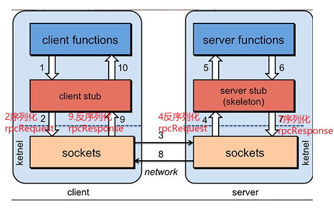
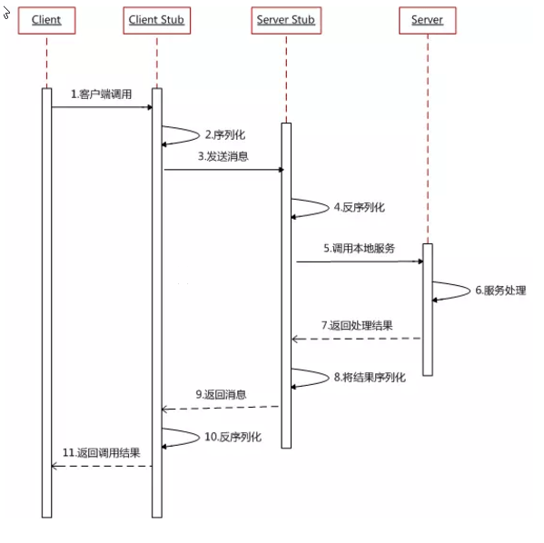
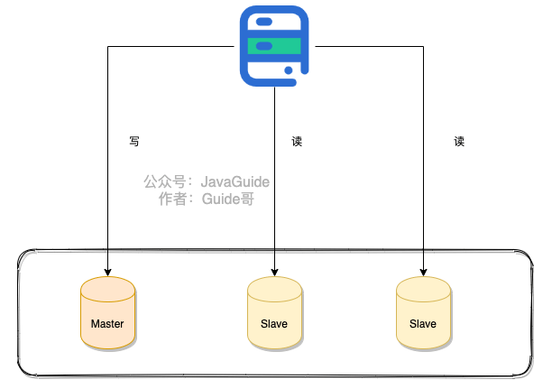
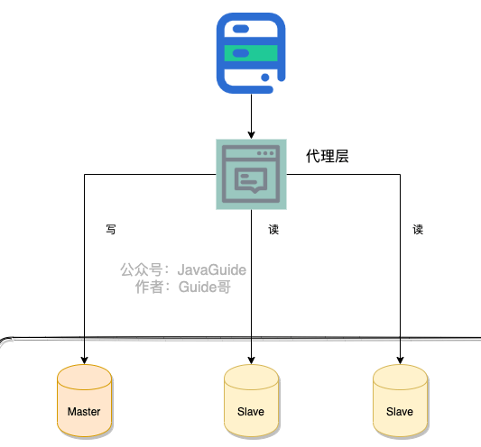
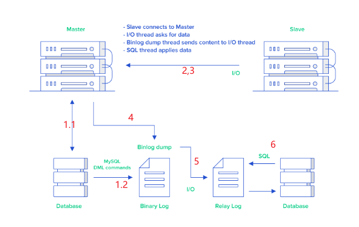
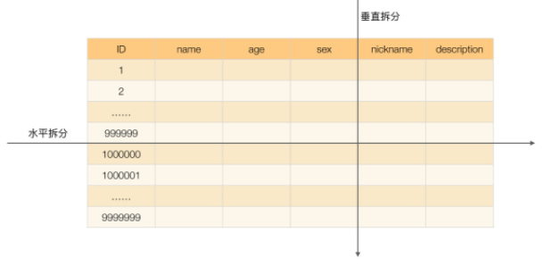
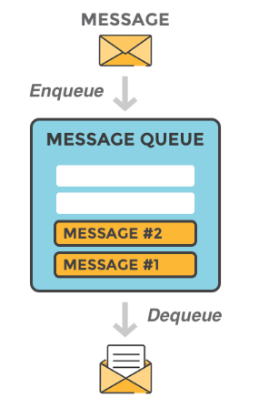
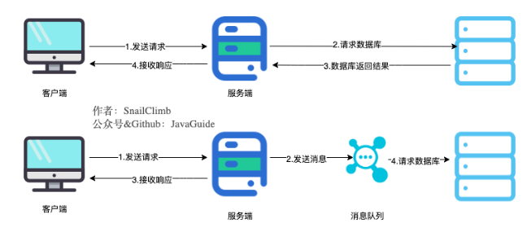
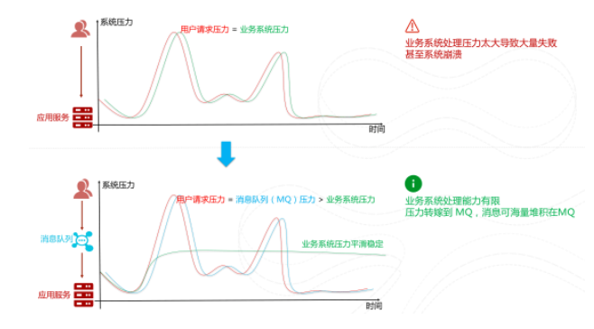
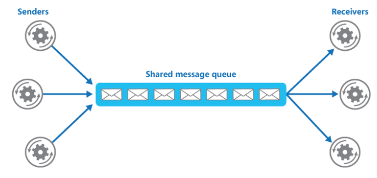

# RPC

## 服务之间的调用为啥不直接用 HTTP 而用 RPC？

RPC（Remote Procedure Call）—远程过程调用，它是一种通过网络从远程计算机程序上请求服务，而不需要了解底层网络技术的协议。比如两个不同的服务 A、B 部署在两台不同的机器上，那么服务 A 如果想要调用服务 B 中的某个方法该怎么办呢？使用 HTTP请求 当然可以，但是可能会比较慢而且一些优化做的并不好。 RPC 的出现就是为了解决这个问题


### **RPC原理是什么？**



1.  服务消费端（client）以本地调用的方式调用远程服务；

2.  客户端 Stub（client stub） 接收到调用后负责将方法、参数等组装成能够进行网络传输的消息体（序列化）：`RpcRequest`；

3.  客户端 Stub（client stub） 找到远程服务的地址，并将消息发送到服务提供端；

4.  服务端 Stub（桩）收到消息将消息反序列化为Java对象: `RpcRequest`；

5.  服务端 Stub（桩）根据`RpcRequest`中的类、方法、方法参数等信息调用本地的方法；

6.  服务端 Stub（桩）得到方法执行结果并将组装成能够进行网络传输的消息体：`RpcResponse`（序列化）发送至消费方；

7.  客户端 Stub（client stub）接收到消息并将消息反序列化为Java对象:`RpcResponse` ，这样也就得到了最终结果。

    >   序列化：对象-》消息
    >
    >   反序列化：消息-》对象
    >
    >   传输的时候用序列化
    >
    >   操作的时候用反序列化



### RPC 解决了什么问题？

从上面对 RPC 介绍的内容中，概括来讲RPC 主要解决了：**让分布式或者微服务系统中不同服务之间的调用像本地调用一样简单。**


### 常见的 RPC 框架总结?

-   **RMI（JDK自带）：** JDK自带的RPC，有很多局限性，不推荐使用。
-   **Dubbo:** Dubbo是 阿里巴巴公司开源的一个高性能优秀的服务框架，使得应用可通过高性能的 RPC 实现服务的输出和输入功能，可以和 Spring框架无缝集成。目前 Dubbo 已经成为 Spring Cloud Alibaba 中的官方组件。
-   **gRPC** ：gRPC是可以在任何环境中运行的现代开源高性能RPC框架。它可以通过可插拔的支持来有效地连接数据中心内和跨数据中心的服务，以实现负载平衡，跟踪，运行状况检查和身份验证。它也适用于分布式计算的最后一英里，以将设备，移动应用程序和浏览器连接到后端服务。
-   **Hessian：** Hessian是一个轻量级的remoting on http工具，使用简单的方法提供了RMI的功能。 相比WebService，Hessian更简单、快捷。采用的是二进制RPC协议，因为采用的是二进制协议，所以它很适合于发送二进制数据。
-   **Thrift：** Apache Thrift是Facebook开源的跨语言的RPC通信框架，目前已经捐献给Apache基金会管理，由于其跨语言特性和出色的性能，在很多互联网公司得到应用，有能力的公司甚至会基于thrift研发一套分布式服务框架，增加诸如服务注册、服务发现等功能。


## 既有 HTTP ,为啥用 RPC 进行服务调用

### RPC 只是一种设计而已

RPC 只是一种概念、一种设计，就是为了解决 **不同服务之间的调用问题**, 它一般会包含有 **传输协议** 和 **序列化协议** 这两个。

但是，HTTP 是一种协议，RPC框架可以使用 HTTP协议作为传输协议或者直接使用TCP作为传输协议，使用不同的协议一般也是为了适应不同的场景。


### HTTP 和 TCP

**可能现在很多对计算机网络不太熟悉的朋友已经被搞蒙了，要想真正搞懂，还需要来简单复习一下计算机网络基础知识：**

>   我们通常谈计算机网络的五层协议的体系结构是指：应用层、传输层、网络层、数据链路层、物理层。
>
>   **应用层(application-layer）的任务是通过应用进程间的交互来完成特定网络应用。** HTTP 属于应用层协议，它会基于TCP/IP通信协议来传递数据（HTML 文件, 图片文件, 查询结果等）。HTTP协议工作于客户端-服务端架构上。浏览器作为HTTP客户端通过 URL 向HTTP服务端即WEB服务器发送所有请求。Web服务器根据接收到的请求后，向客户端发送响应信息。HTTP协议建立在 TCP 协议之上。
>
>   **传输层(transport layer)的主要任务就是负责向两台主机进程之间的通信提供通用的数据传输服务**。TCP是传输层协议，主要解决数据如何在网络中传输。相比于UDP,**TCP** 提供的是**面向连接**的，**可靠的**数据传输服务。


### RPC框架功能更齐全

成熟的 RPC框架还提供好了“服务自动注册与发现”、"智能负载均衡"、“可视化的服务治理和运维”、“运行期流量调度”等等功能，这些也算是选择 RPC 进行服务注册和发现的一方面原因吧！


# 读写分离&分库分表

## 读写分离

**读写分离主要是为了将对数据库的读写操作分散到不同的数据库节点上。** 这样的话，就能够小幅提升写性能，大幅提升读性能。



一般情况下，我们都会选择一主多从，也就是一台主数据库负责写，其他的从数据库负责读。主库和从库之间会进行数据同步，以保证从库中数据的准确性。这样的架构实现起来比较简单，并且也符合系统的写少读多的特点


### 读写分离会带来什么问题？如何解决？

读写分离对于提升数据库的并发非常有效，但是，同时也会引来一个问题：主库和从库的数据存在延迟，比如你写完主库之后，主库的数据同步到从库是需要时间的，这个时间差就导致了主库和从库的数据不一致性问题。这也就是我们经常说的 **主从同步延迟** 。

主从同步延迟问题的解决，没有特别好的一种方案（可能是我太菜了，欢迎评论区补充）。你可以根据自己的业务场景，参考一下下面几种解决办法。

**1.强制将读请求路由到主库处理。**

既然你从库的数据过期了，那我就直接从主库读取嘛！这种方案虽然会增加主库的压力，但是，实现起来比较简单，也是我了解到的使用最多的一种方式。

比如 `Sharding-JDBC` 就是采用的这种方案。通过使用 Sharding-JDBC 的 `HintManager` 分片键值管理器，我们可以强制使用主库。

```java
HintManager hintManager = HintManager.getInstance();
hintManager.setMasterRouteOnly();
// 继续JDBC操作
```

对于这种方案，你可以将那些必须获取最新数据的读请求都交给主库处理。

**2.延迟读取。**

还有一些朋友肯定会想既然主从同步存在延迟，那我就在延迟之后读取啊，比如主从同步延迟 0.5s,那我就 1s 之后再读取数据。这样多方便啊！方便是方便，但是也很扯淡。

不过，如果你是这样设计业务流程就会好很多：对于一些对数据比较敏感的场景，你可以在完成写请求之后，避免立即进行请求操作。比如你支付成功之后，跳转到一个支付成功的页面，当你点击返回之后才返回自己的账户。


### 如何实现读写分离？

不论是使用哪一种读写分离具体的实现方案，想要实现读写分离一般包含如下几步：

1.  部署多台数据库，选择其中的一台作为主数据库，其他的一台或者多台作为从数据库。
2.  保证主数据库和从数据库之间的数据是**实时同步**的，这个过程也就是我们常说的**主从复制**。
3.  系统将写请求交给主数据库处理，读请求交给从数据库处理。

落实到项目本身的话，常用的方式有两种：

**1.代理方式**



我们可以在应用和数据中间加了一个代理层。应用程序所有的数据请求都交给代理层处理，代理层负责分离读写请求，将它们路由到对应的数据库中。

提供类似功能的中间件有 **MySQL Router**（官方）、**Atlas**（基于 MySQL Proxy）、**Maxscale**、**MyCat**。


**2.组件方式**

在这种方式中，我们可以通过引入第三方组件来帮助我们读写请求。

这也是我比较推荐的一种方式。这种方式目前在各种互联网公司中用的最多的，相关的实际的案例也非常多。如果你要采用这种方式的话，推荐使用 `sharding-jdbc` ，直接引入 jar 包即可使用，非常方便。同时，也节省了很多运维的成本。


### 主从复制原理了解么？

>   - binlog :（一致性、主从同步）
>
>       bin log是数据库**server层日志**，和存储引擎无关，以二进制形式存储在磁盘中的逻辑日志，记录了所有DDL和DML操作(不包括select和show)。不管用什么存储引擎，只要发生了**表数据更新**，都会产生 `binlog` 日志。`MySQL`数据库的**数据备份、主备、主主、主从**都离不开`binlog`，需要依靠`binlog`来同步数据，保证数据**一致性**。
>
>       `binlog`会记录所有涉及**更新数据**的逻辑操作，并且是顺序写。
>
>   - relay log：（中转、主从复制）
>
>       relay log和bin log具有相同的格式，上面主从复制流程页提到了relay log,其主要作用起到一个中转作用。

MySQL binlog(binary log 即二进制日志文件) 主要记录了 MySQL 数据库中数据的所有变化(数据库执行的所有 DDL 和 DML 语句)。因此，我们根据主库的 MySQL binlog 日志就能够将主库的数据同步到从库中。



1.  主库将数据库中数据的变化写入到 binlog
2.  从库连接主库
3.  从库会创建一个 I/O 线程向主库请求更新的 binlog
4.  主库会创建一个 binlog dump 线程来发送 binlog ，从库中的 I/O 线程负责接收
5.  **从库**的 I/O 线程将接收的 binlog 写入到 relay log 中。
6.  从库的 SQL 线程读取 relay log 同步数据本地（也就是再执行一遍 SQL ）。

>   你一般看到 binlog 就要想到主从复制。当然，除了主从复制之外，binlog 还能帮助我们实现数据恢复。


## 分库分表

**读写分离主要应对的是数据库读并发**，没有解决数据库存储问题。试想一下：**如果 MySQL 一张表的数据量过大怎么办?**

换言之，**我们该如何解决 MySQL 的存储压力呢？**

答案之一就是 **分库分表**。


### 何为分库？

**分库** 就是将数据库中的数据分散到不同的数据库上。

下面这些操作都涉及到了分库：

-   你将数据库中的用户表和用户订单表**分别放在两个不同的数据库**。
-   由于用户表数据量太大，你对用户表进行了**水平切分**，然后将切分后的 2 张用户表分别放在两个不同的数据库。


### 何为分表？

**分表** 就是对**单表的数据进行拆分**，可以是垂直拆分，也可以是水平拆分。

**何为垂直拆分？**

简单来说，垂直拆分是对数据表列的拆分，把一张列比较多的表拆分为多张表。

举个例子：我们可以将用户信息表中的一些列单独抽出来作为一个表。

**何为水平拆分？**

简单来说，水平拆分是对数据表行的拆分，把一张行比较多的表拆分为多张表。

举个例子：我们可以将用户信息表拆分成多个用户信息表，这样就可以避免单一表数据量过大对性能造成影响。




### 什么情况下需要分库分表？

遇到下面几种场景可以考虑分库分表：

-   单表的数据达到千万级别以上，数据库读写速度比较缓慢（分表）。
-   数据库中的数据占用的空间越来越大，备份时间越来越长（分库）。
-   应用的并发量太大（分库）。


### 分库分表会带来什么问题呢？

记住，你在公司做的任何技术决策，不光是要考虑这个技术能不能满足我们的要求，是否适合当前业务场景，还要重点考虑其带来的成本。

引入分库分表之后，会给系统带来什么挑战呢？

-   **join 操作** ： 同一个数据库中的表分布在了不同的数据库中，导致无法使用 join 操作。这样就导致我们需要手动进行数据的封装，比如你在一个数据库中查询到一个数据之后，再根据这个数据去另外一个数据库中找对应的数据。
-   **事务问题** ：同一个数据库中的表分布在了不同的数据库中，如果单个操作涉及到多个数据库，那么数据库自带的事务就无法满足我们的要求了。
-   **分布式 id** ：分库之后， 数据遍布在不同服务器上的数据库，数据库的自增主键已经没办法满足生成的主键唯一了。我们如何为不同的数据节点生成全局唯一主键呢？这个时候，我们就需要为我们的系统引入分布式 id 了。
-   ......

另外，引入分库分表之后，一般需要 DBA 的参与，同时还需要更多的数据库服务器，这些都属于成本


### 分库分表有没有什么比较推荐的方案？

ShardingSphere 项目（包括 Sharding-JDBC、Sharding-Proxy 和 Sharding-Sidecar）是当当捐入 Apache 的，目前主要由京东数科的一些巨佬维护。

hardingSphere 绝对可以说是当前分库分表的首选！ShardingSphere 的功能完善，除了支持读写分离和分库分表，还提供分布式事务、数据库治理等功能。

另外，ShardingSphere 的生态体系完善，社区活跃，文档完善，更新和发布比较频繁。


### 分库分表后，数据怎么迁移呢？

分库分表之后，我们如何将老库（单库单表）的数据迁移到新库（分库分表后的数据库系统）呢？

比较简单同时也是非常常用的方案就是**停机迁移**，写个脚本老库的数据写到新库中。比如你在凌晨 2 点，系统使用的人数非常少的时候，挂一个公告说系统要维护升级预计 1 小时。然后，你写一个脚本将老库的数据都同步到新库中。

如果你不想停机迁移数据的话，也可以考虑**双写方案**。双写方案是针对那种不能停机迁移的场景，实现起来要稍微麻烦一些。具体原理是这样的：

-   我们对老库的更新操作（增删改），同时也要写入新库（双写）。如果操作的数据不存在于新库的话，需要插入到新库中。 这样就能保证，咱们新库里的数据是最新的。
-   在迁移过程，双写只会让被更新操作过的老库中的数据同步到新库，我们还需要自己写脚本将老库中的数据和新库的数据做比对。如果新库中没有，那咱们就把数据插入到新库。如果新库有，旧库没有，就把新库对应的数据删除（冗余数据清理）。
-   重复上一步的操作，直到老库和新库的数据一致为止。

想要在项目中实施双写还是比较麻烦的，很容易会出现问题。我们可以借助上面提到的数据库同步工具 Canal 做增量数据迁移（还是依赖 binlog，开发和维护成本较低）。


# 负载均衡

负载均衡系统通常用于将任务比如用户请求处理分配到多个服务器处理以提高网站、应用或者数据库的性能和可靠性。

常见的负载均衡系统包括 3 种：

1.  **DNS 负载均衡** ：一般用来实现地理级别的均衡。
2.  **硬件负载均衡** ： 通过单独的硬件设备比如 F5 来实现负载均衡功能（硬件的价格一般很贵）。
3.  **软件负载均衡** ：通过负载均衡软件比如 Nginx 来实现负载均衡功能


# 消息队列

##  什么是消息队列

我们可以把消息队列看作是一个存放消息的容器，当我们需要使用消息的时候，直接从容器中取出消息供自己使用即可。



消息队列是分布式系统中重要的组件之一。使用消息队列主要是为了通过**异步处理**提高系统性能和削峰、降低系统耦合性。

我们知道队列 Queue 是一种**先进先出**的数据结构，所以消费消息时也是按照顺序来消费的


## 为什么要用消息队列

通常来说，使用消息队列能为我们的系统带来下面三点好处：

1.  **通过异步处理提高系统性能（减少响应所需时间）。**

2.  **削峰/限流**

3.  **降低系统耦合性。**

    

### 通过异步处理提高系统性能（减少响应所需时间）



将用户的请求数据存储到消息队列之后就立即返回结果。随后，系统再对消息进行消费。

因为用户请求数据写入消息队列之后就立即返回给用户了，但是请求数据在后续的业务校验、写数据库等操作中可能失败。因此，**使用消息队列进行异步处理之后，需要适当修改业务流程进行配合**，比如用户在提交订单之后，订单数据写入消息队列，不能立即返回用户订单提交成功，需要在消息队列的订单消费者进程真正处理完该订单之后，甚至出库后，再通过电子邮件或短信通知用户订单成功，以免交易纠纷。这就类似我们平时手机订火车票和电影票。


###  削峰/限流

**先将短时间高并发产生的事务消息存储在消息队列中，然后后端服务再慢慢根据自己的能力去消费这些消息，这样就避免直接把后端服务打垮掉。**

举例：在电子商务一些秒杀、促销活动中，合理使用消息队列可以有效抵御促销活动刚开始大量订单涌入对系统的冲击。如下图所示：



### 降低系统耦合性

使用消息队列还可以降低系统耦合性。我们知道如果模块之间不存在直接调用，那么新增模块或者修改模块就对其他模块影响较小，这样系统的可扩展性无疑更好一些。还是直接上图吧：



生产者（客户端）发送消息到消息队列中去，接受者（服务端）处理消息，需要消费的系统直接去消息队列取消息进行消费即可而不需要和其他系统有耦合，这显然也提高了系统的扩展性。

**消息队列使用发布-订阅模式工作，消息发送者（生产者）发布消息，一个或多个消息接受者（消费者）订阅消息。** 从上图可以看到**消息发送者（生产者）和消息接受者（消费者）之间没有直接耦合**，消息发送者将消息发送至分布式消息队列即结束对消息的处理，消息接受者从分布式消息队列获取该消息后进行后续处理，并不需要知道该消息从何而来。**对新增业务，只要对该类消息感兴趣，即可订阅该消息，对原有系统和业务没有任何影响，从而实现网站业务的可扩展性设计**。

消息接受者对消息进行过滤、处理、包装后，构造成一个新的消息类型，将消息继续发送出去，等待其他消息接受者订阅该消息。因此基于事件（消息对象）驱动的业务架构可以是一系列流程。

另外，为了避免消息队列服务器宕机造成消息丢失，会将成功发送到消息队列的消息存储在消息生产者服务器上，等消息真正被消费者服务器处理后才删除消息。在消息队列服务器宕机后，生产者服务器会选择分布式消息队列服务器集群中的其他服务器发布消息。

**备注：** 不要认为消息队列只能利用发布-订阅模式工作，只不过在解耦这个特定业务环境下是使用发布-订阅模式的。除了发布-订阅模式，还有点对点订阅模式（一个消息只有一个消费者），我们比较常用的是发布-订阅模式。另外，这两种消息模型是 JMS 提供的，AMQP 协议还提供了 5 种消息模型。


## 使用消息队列带来的一些问题

-   **系统可用性降低：** 系统可用性在某种程度上降低，为什么这样说呢？在加入 MQ 之前，你不用考虑消息丢失或者说 MQ 挂掉等等的情况，但是，引入 MQ 之后你就需要去考虑了！
-   **系统复杂性提高：** 加入 MQ 之后，你需要保证消息没有被重复消费、处理消息丢失的情况、保证消息传递的顺序性等等问题！
-   **一致性问题：** 我上面讲了消息队列可以实现异步，消息队列带来的异步确实可以提高系统响应速度。但是，万一消息的真正消费者并没有正确消费消息怎么办？这样就会导致数据不一致的情况了


## JMS VS AMQP

### JMS

####  JMS 简介

JMS（JAVA Message Service,java 消息服务）是 **java 的消息服务**，JMS 的客户端之间可以通过 JMS 服务进行异步的消息传输。**JMS（JAVA Message Service，Java 消息服务）API 是一个消息服务的标准或者说是规范**，允许应用程序组件基于 JavaEE 平台创建、发送、接收和读取消息。它使分布式通信耦合度更低，消息服务更加可靠以及异步性。

**ActiveMQ 就是基于 JMS 规范实现的。**


####  JMS 两种消息模型

**① 点到点（P2P）模型**


使用**队列（Queue）\**作为消息通信载体；满足\**生产者与消费者模式**，一条消息只能被一个消费者使用，未被消费的消息在队列中保留直到被消费或超时。比如：我们生产者发送 100 条消息的话，两个消费者来消费一般情况下两个消费者会按照消息发送的顺序各自消费一半（也就是你一个我一个的消费。）

**② 发布/订阅（Pub/Sub）模型**


发布订阅模型（Pub/Sub） 使用**主题（Topic）\**作为消息通信载体，类似于\**广播模式**；发布者发布一条消息，该消息通过主题传递给所有的订阅者，**在一条消息广播之后才订阅的用户则是收不到该条消息的**。

#### JMS 五种不同的消息正文格式

JMS 定义了五种不同的消息正文格式，以及调用的消息类型，允许你发送并接收以一些不同形式的数据，提供现有消息格式的一些级别的兼容性。

-   StreamMessage -- Java 原始值的数据流
-   MapMessage--一套名称-值对
-   TextMessage--一个字符串对象
-   ObjectMessage--一个序列化的 Java 对象
-   BytesMessage--一个字节的数据流

### AMQP

AMQP，即 Advanced Message Queuing Protocol，一个提供统一消息服务的应用层标准 **高级消息队列协议**（二进制应用层协议），是应用层协议的一个开放标准，为面向消息的中间件设计，兼容 JMS。基于此协议的客户端与消息中间件可传递消息，并不受客户端/中间件同产品，不同的开发语言等条件的限制。